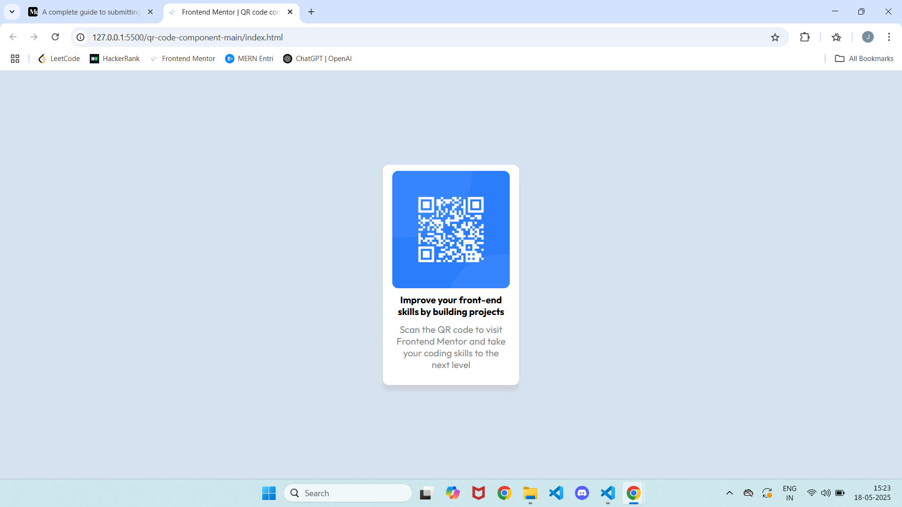
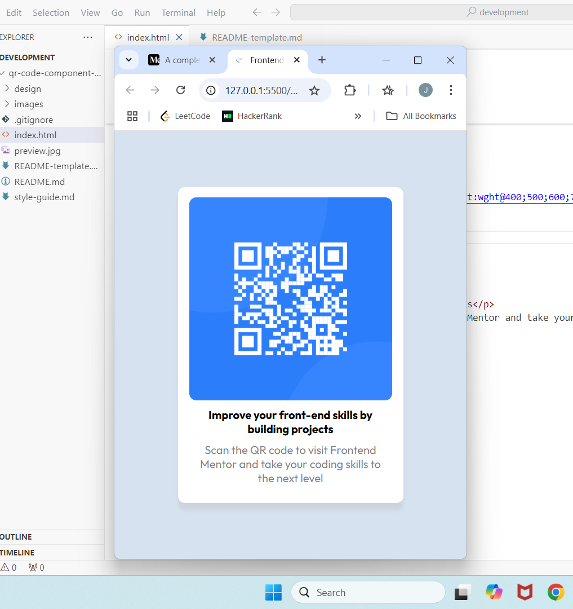

# Frontend Mentor - QR code component solution

This is a solution to the [QR code component challenge on Frontend Mentor](https://www.frontendmentor.io/challenges/qr-code-component-iux_sIO_H). Frontend Mentor challenges help you improve your coding skills by building realistic projects. 

## Table of contents

- [Overview](#overview)
  - [Screenshot](#screenshot)
  - [Links](#links)
- [My process](#my-process)
  - [Built with](#built-with)
  - [What I learned](#what-i-learned)
  - [Continued development](#continued-development)
  - [Useful resources](#useful-resources)
- [Author](#author)
- [Acknowledgments](#acknowledgments)

## Overview
Created a QR code card.

### Screenshot

### Links

- Solution URL: [Add solution URL here](https://your-solution-url.com)
- Live Site URL: [Add live site URL here](https://your-live-site-url.com)

## My process

### Built with

- Semantic HTML5 markup
- CSS custom properties
- Flexbox

### What I learned

How to use Flexbox to position elements.

How to apply responsive design using media queries (min-width and max-width).

How to style elements and to enhance UI.

How to use and manage font weights for visual hierarchy.

### Continued development
Use grid for page layout.
Enhance responsiveness for more screen sizes.

## Author

- Website - [Jawad C S](https://jawadcs-portfolio.netlify.app/)
- Frontend Mentor - [@Learner531](https://www.frontendmentor.io/profile/Learner531)
